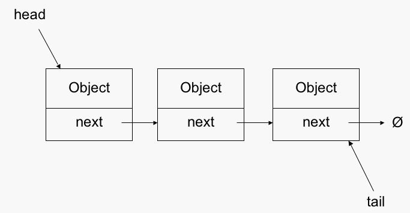
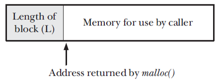
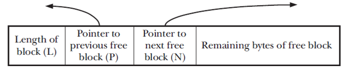
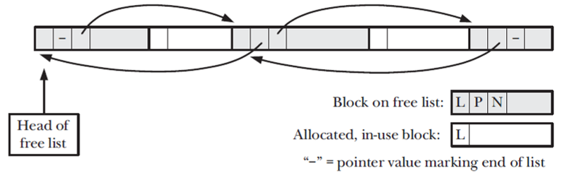

### Memory Allocation

Lecture 5 - Memory Allocation
EE3233 Systems Programming for Engrs
Reference: M. Kerrisk, The Linux Programming Interface


___
### Allocating dynamic memory
* Memory system programs need to allocate  extra memory for dynamic data structures (e.g., linked lists and binary trees)
Size of such data structure depends on information available only at run time




___
### Allocating Memory on the Heap
* A process can allocate memory by increasing size of the heap
  * Current limit of heap : Program break
* To allocate memory, C programs normally use the malloc family functions: `brk()`, `sbrk()`
* Initially, the program break lies just past the end of the uninitialized data segment

Typical memory layout of a process 
on Linux/x86_32


___
### Adjusting the Program Break: brk(), sbrk()
* Telling the kernel to adjust idea of where the process’s program break is
  * After the program break is increased, the program may access, but no physical memory pages are allocated yet
  * Kernel automatically allocates new physical pages on the first attempt by the process to access
  * `brk()`, `sbrk()` manipulate program break

___
### brk()

```C
int brk(void *end_data_segment);
// returns 0 on success, or -1 on error
```
* `brk()` system call sets the program break to the location specified by **end_data_segment**
  * Virtual memory is allocated in units of pages, thus **end_data_segment** is rounded up
* Attempt to set the program break below its initial value (i.e., below _&end_) results in a segmentation fault

___
### sbrk()

```C
void *sbrk(intptr_t increment);
// returns previous program break on success, or -1 on error
```
* `sbrk()` system call adjusts the program break by adding **increment** to it
* On success, `sbrk()` returns the previous address of the program break
  * If we have increased the program break, the return value points to the start of the newly allocated block of memory

___
### malloc()

```C
#include <stdlib.h>

void *malloc(size_t size);
// returns pointer to allocated memory on success, or NULL on error
```

* Allocates **size** bytes from the heap and returns a pointer to the start of the newly allocated block of memory

___
### free()
```C
#include <stdlib.h>

void free(void *ptr);
```
* Deallocates the block of memory pointed by its **ptr** argument
* In general, `free()` **doesn’t lower the program break**, but instead adds the block of memory to a list of free blocks that are recycled by future calls to `malloc()`
  * The block of memory being freed is typically somewhere in the middle of the heap, rather than at the end, so lowering it is not possible

___
### Example code

```C
#include <stdio.h>
#include <stdlib.h>
#include <unistd.h>
#include <string.h>

#define MAX_ALLOCS 1000000

void errorExit(const char *msg) {
    perror(msg);
    exit(EXIT_FAILURE);
}

int getInt(const char *str) {
    return atoi(str);
}

int main(int argc, char *argv[])
{
    char *ptr[MAX_ALLOCS];
    int freeStep, freeMin, freeMax, blockSize, numAllocs, j;

    printf("\n");

    if (argc < 3 || strcmp(argv[1], "--help") == 0) {
        fprintf(stderr, "Usage: %s num-allocs block-size [step [min [max]]]\n", argv[0]);
        exit(EXIT_FAILURE);
    }

    numAllocs = getInt(argv[1]);
    if (numAllocs <= 0 || numAllocs > MAX_ALLOCS) {
        fprintf(stderr, "Invalid value for num-allocs\n");
        exit(EXIT_FAILURE);
    }

    blockSize = getInt(argv[2]);
    if (blockSize <= 0) {
        fprintf(stderr, "Invalid block size\n");
        exit(EXIT_FAILURE);
    }

    freeStep = (argc > 3) ? getInt(argv[3]) : 1;
    freeMin =  (argc > 4) ? getInt(argv[4]) : 1;
    freeMax =  (argc > 5) ? getInt(argv[5]) : numAllocs;

    if (freeMax > numAllocs) {
        fprintf(stderr, "free-max > num-allocs\n");
        exit(EXIT_FAILURE);
    }

    printf("Initial program break:          %10p\n", sbrk(0));

    printf("Allocating %d*%d bytes\n", numAllocs, blockSize);
    for (j = 0; j < numAllocs; j++) {
        ptr[j] = malloc(blockSize);
        if (ptr[j] == NULL)
            errorExit("malloc");
    }

    printf("Program break is now:           %10p\n", sbrk(0));

    printf("Freeing blocks from %d to %d in steps of %d\n",
                freeMin, freeMax, freeStep);
    for (j = freeMin - 1; j < freeMax; j += freeStep)
        free(ptr[j]);

    printf("After free(), program break is: %10p\n", sbrk(0));

    exit(EXIT_SUCCESS);
}
```

```bash
$ ./free_and_sbrk 1000 10240 2
Initial program break:          0x804a6bc
Allocating 1000*10240 bytes
Program break is now:           0x8a13000
Freeing blocks from 1 to 1000 in steps of 2
After free(), program break is: 0x8a13000

```
* Arguments:
  * num-allocs: 1000
  * block-size: 10240
  * step: 2
* The program will allocate 10 MB of memory in blocks of 10 KB each. It will then free every second block, starting from the first block. The program will display the program break before allocation, after allocation, and after deallocation to allow you to see how the memory usage of the program changes over its execution.

```bash
$ ./free_and_sbrk 1000 10240 1 1 999
Initial program break:          0x804a6bc
Allocating 1000*10240 bytes
Program break is now:           0x8a13000
Freeing blocks from 1 to 999 in steps of 1
After free(), program break is: 0x8a13000
```

* Arguments:
  * num-allocs: 1000
  * block-size: 10240
  * step: 1
  * min: 1
  * max: 999

* The program will first allocate about 10 MB of memory in blocks of 10 KB each.
* It will then systematically free every single block from the first to the 999th.
* The printout will display the memory break:
  * Before any allocations.
  * After the 10 MB allocation.
  * After freeing the first 999 blocks, with only the 1000th block remaining allocated.

If we free a complete set of blocks at the top end of the heap, we see that the program break decreases from its peak value


```bash
$ ./free_and_sbrk 1000 10240 1 500 1000
Initial program break:          0x804a6bc
Allocating 1000*10240 bytes
Program break is now:           0x8a13000
Freeing blocks from 500 to 1000 in steps of 1
After free(), program break is: 0x852b000
```

___
### Implementation of malloc()
* First scans the list of memory blocks previously released by `free()`
  * to find one whose size is larger than or equal to requirements
  * If the block is exactly the same size, then it is returned to the caller
  * If larger, then split; correct size is returned and smaller one is left on the free list
* If no block on the free list is large enough, then `malloc()` calls `sbrk()`


### Implementation of free()
* When `free()` places a block of memory onto the free list, how does it know what size that block is?
  * When `malloc()` allocates the block, it allocates extra bytes to hold an integer containing the size of the block
  * The integer is located at the beginning of the block; the address actually returned to the caller points to the location just past this length
  * The memory block returned by malloc() looks like below



### Implementation of free()
* When a block is placed on the free list, free() uses the bytes of the block itself in order to add the block to the list, as shown below



* As blocks are deallocated and reallocated over time, the blocks of the free list will become intermingled with allocated (in-use) blocks



* C allows create pointers to any location in the heap
  * can modify locations (length, previous and next free block) they point to 
* If we accidentally increase one of the length values preceding an allocated block &#8594; subsequently deallocate that block, then `free()` will record the wrong size block on the list &#8594; subsequently allocate that block by `malloc()`, then program will have overlapped blocks

* After we allocate a block of memory, we should be careful not to touch any bytes outside the range of that block
* It is an error to free the same piece of allocated memory more than once
* We should never call `free()` with a pointer value that wasn’t obtained by a call to one of the functions in the _malloc_ package
* If you are writing a long-running program that repeatedly allocates memory for various purposes, then you should ensure that you deallocated any memory after you have finished using it 
  * Heap will steadily grow until reaching limits of available virtual memory (memory leak)

```C
#include <stdio.h>
#include <stdlib.h>

int main() {
    int *arr;
    int n, i;

    // Get the number of integers to be allocated
    printf("Enter the number of integers: ");
    scanf("%d", &n);

    // Allocate memory for 'n' integers
    arr = (int *)malloc(n * sizeof(int));

    // Check if the memory has been successfully allocated
    if (arr == NULL) {
        printf("Memory allocation failed\n");
        return 1;
    }

    // Store values in the allocated memory
    printf("Enter %d integers:\n", n);
    for (i = 0; i < n; i++) {
        scanf("%d", &arr[i]);
    }

    // Display the values
    printf("Entered integers are:\n");
    for (i = 0; i < n; i++) {
        printf("%d ", arr[i]);
    }
    printf("\n");

    // Deallocate the memory
    free(arr);

    return 0;
}
```