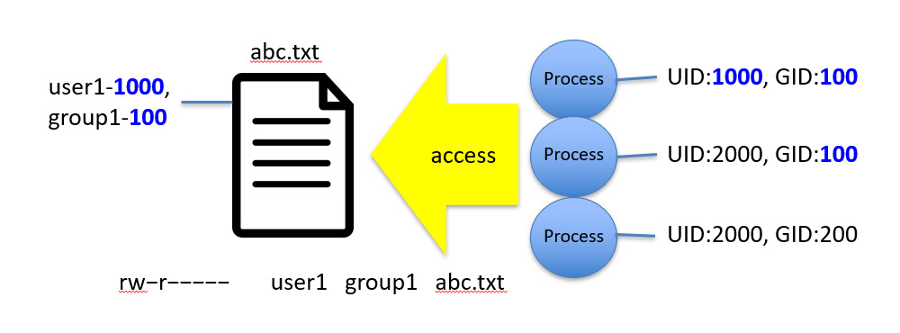
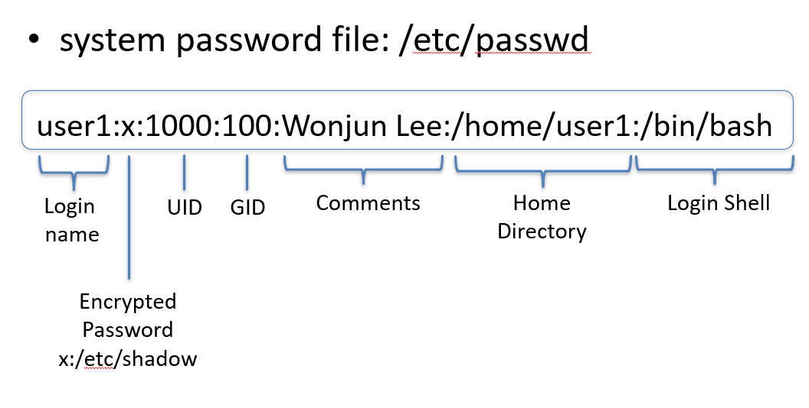
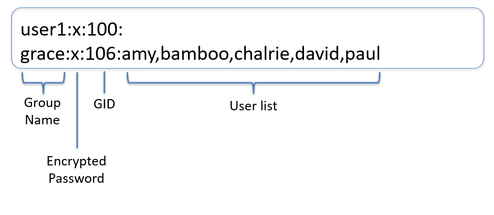
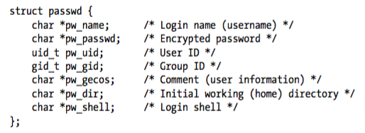
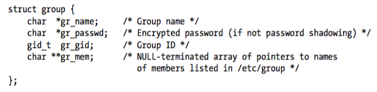
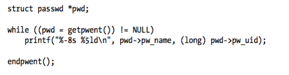
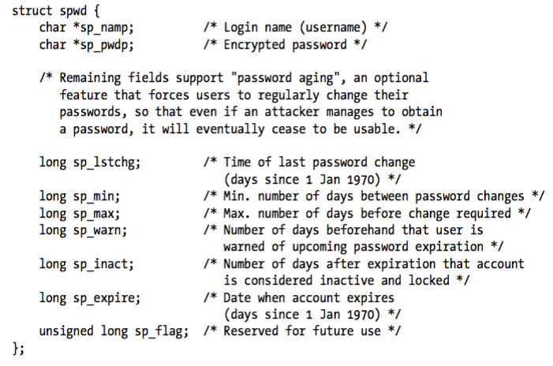
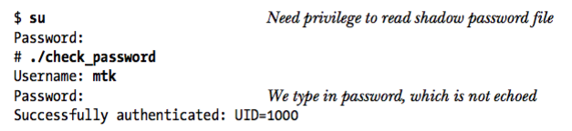

# Users and Groups

Lecture 6 - Users and Groups
EE3233 Systems Programming for Engrs
Reference: M. Kerrisk, The Linux Programming Interface


___
## UID and GID

* UID: Every user has a unique login name and associated numeric user identifier
* GID: Users can belong to one or more groups
  * Each group also has a unique name and a group identifier: GID


* Primary purpose of user and group ID is to determine ownership of system resources and to control the permissions granted to processes accessing those resources




## /etc/passwd




* **/etc/passwd**: publicly readable
  * Password cracking was possible (thus, password moved to /etc/shadow)
  * contains nonsensitive user information
* **/etc/shadow**: encrypted passwords are maintained


## /etc/group

* organizing groups: useful to control access to files and system resources



## Retrieving Records from password file

```C
#include <pwd.h>

struct passwd *getpwnam(const char *name);
```

Given a login name, it returns a pointer to a structure of the following type




## Retrieving Records from password file

```C
#include <pwd.h>

struct passwd *getpwuid(uid_t uid)
```
* Given a uid, returns exactly the same info as `getpwnam()`
  * but does a lookup using the numeric user ID


## Retrieving Records from group file

```C
#include <grp.h>

struct group *getgrnam(const char *name);
struct group *getgrgid(gid_t gid);
```

* Given a group name and group ID, they return a pointer to a structure of the following type




## Get User Name from UID

C Example
```C
#include <stdio.h>
#include <pwd.h>

int main() {
    uid_t uid = 1000;
    struct passwd *pwd;
    
    pwd = getpwuid(uid);
    if (pwd == NULL) {
        printf("No user found with uid %d\n", uid);
    } else {
        printf("User name for uid %d is %s\n", uid, pwd->pw_name);
    }

    return 0;
}
```

Python Example
```python
import pwd

def user_name_from_id(uid):
    try:
        user_name = pwd.getpwuid(uid).pw_name
    except KeyError:
        return None
    return user_name

uid = 1000
user_name = user_name_from_id(uid)
if user_name:
    print(f"User name for uid {uid} is {user_name}")
else:
    print(f"No user found with uid {uid}")

```

## Get UID from User Name

C Example
```C
#include <stdio.h>
#include <pwd.h>

int main() {
    const char *name = "john";
    struct passwd *pwd;
    
    pwd = getpwnam(name);
    if (pwd == NULL) {
        printf("No user found with name %s\n", name);
    } else {
        printf("UID for user %s is %d\n", name, pwd->pw_uid);
    }

    return 0;
}
```

Python Example
```python
import pwd

def user_id_from_name(name):
    try:
        uid = pwd.getpwnam(name).pw_uid
    except KeyError:
        return -1
    return uid

name = "user"
uid = user_id_from_name(name)
if uid != -1:
    print(f"UID for user {name} is {uid}")
else:
    print(f"No user found with name {name}")
```

## Get Group Name from GID

C Example
```C
#include <stdio.h>
#include <grp.h>

int main() {
    gid_t gid = 1000;
    struct group *grp;
    
    grp = getgrgid(gid);
    if (grp == NULL) {
        printf("No group found with gid %d\n", gid);
    } else {
        printf("Group name for gid %d is %s\n", gid, grp->gr_name);
    }

    return 0;
}
```
Python Example
```python
import grp

def group_name_from_id(gid):
    try:
        group_name = grp.getgrgid(gid).gr_name
    except KeyError:
        return None
    return group_name

gid = 1000
group_name = group_name_from_id(gid)
if group_name:
    print(f"Group name for gid {gid} is {group_name}")
else:
    print(f"No group found with gid {gid}")
```

## Get GID from Group Name

C Example
```C
#include <stdio.h>
#include <grp.h>

int main() {
    const char *name = "admin";
    struct group *grp;
    
    grp = getgrnam(name);
    if (grp == NULL) {
        printf("No group found with name %s\n", name);
    } else {
        printf("GID for group %s is %d\n", name, grp->gr_gid);
    }

    return 0;
}
```

```python
import grp

def group_id_from_name(name):
    try:
        gid = grp.getgrnam(name).gr_gid
    except KeyError:
        return -1
    return gid

name = "admin"
gid = group_id_from_name(name)
if gid != -1:
    print(f"GID for group {name} is {gid}")
else:
    print(f"No group found with name {name}")
```

## Scanning all records in the password and group files

* Sequential scans of the records in the password file:
* `getpwent()`
* `setpwent()`
* `endpwent()`

## getpwent( ), setpwent( ), endpwent( )

```C
#include <pwd.h>

struct passwd *getpwent(void);
void setpwent(void);
void endpwent(void);
```
* `getpwent()` returns records from the password file one by one
  * On the first call, `getpwent()` automatically opens the password file
* When finished, call `endpwent()` to close it so that subsequent call will reopen it
* we can use `setpwent()` to restart form the beginning


## getpwent( ), setpwent( ), endpwent( )




## Retrieving records from shadow password file

```C
#include <shadow.h>

struct spwd *getspnam(const char *name);
	 	returns pointer to spwd structure on success

struct spwd *getspent(void);
		returns pointer to spwd structure on success

void setspent(void);
void endspent(void);
```

## Retrieving records from shadow password file




## Password Encryption

* one way encryption algorithm: there is no method of re-creating the original password from its encrypted form
  * Only way of validating is to encrypt it using the same method and see if matched with the value stored in _/etc/passwd_
* The encryption algorithm is encapsulated in the `crypt()` function

## crypt()

```C
#include <unistd.h>

char *crypt(const char *key, const char *salt);
			returns pointer to statically allocated string 
			containing encrypted password on success
```
* key: Data Encryption Standard (DES) applies to key (password)
* salt: 2-character string used to perturb (vary) the algorithm
  * characters are selected from 62-character set [a-zA-Z0-9]. Thus varies in 62*62=4094 different ways
  * cracker would need to check the password against 3844 versions of dictionary

* The encrypted password returned by crypt() contains a copy of the original salt value as its first two characters
  * When encrypting a candidate password,  we can obtain the appropriate salt value from the encrypted password value already stored in _/etc/shadow_

## getpass()

```C
#include <unistd.h>

char *getpass(const char *prompt);
			returns pointer to statically allocated input
			password string on success
```

* disables echoing and processing of terminal special characters (such as Control-C)
* prints the string pointed to by prompt
* reads a line of input
* returns null-terminated input string with the newline stripped

## example code

* The next program reads a password with `getpass()`
* validates that password by using `crypt()` to encrypt it
* checks that the resulting string matches the encrypted password recorded in the shadow password file
* If matched, then the ID of the user is displayed

## Slide 27

Authenticating a user against the shadow password file

C Example

```C
#include <unistd.h>
#include <limits.h>
#include <pwd.h>
#include <shadow.h>
#include <stdio.h>
#include <stdlib.h>
#include <string.h>
#include <errno.h>

int main(int argc, char *argv[])
{
    char *username, *password, *encrypted, *p;
    struct passwd *pwd;
    struct spwd *spwd;
    int authOk;
    size_t len;
    long lnmax;

    lnmax = sysconf(_SC_LOGIN_NAME_MAX);
    if (lnmax == -1)
        lnmax = 256;

    username = malloc(lnmax);
    if (username == NULL) {
        perror("malloc");
        exit(EXIT_FAILURE);
    }

    printf("Username: ");
    fflush(stdout);
    if (fgets(username, lnmax, stdin) == NULL)
        exit(EXIT_FAILURE);

    len = strlen(username);
    if (username[len - 1] == '\n')
        username[len - 1] = '\0';

    pwd = getpwnam(username);
    if (pwd == NULL) {
        fprintf(stderr, "couldn't get password record\n");
        exit(EXIT_FAILURE);
    }
    spwd = getspnam(username);
    if (spwd == NULL && errno == EACCES) {
        fprintf(stderr, "no permission to read shadow password file\n");
        exit(EXIT_FAILURE);
    }

    if (spwd != NULL)
        pwd->pw_passwd = spwd->sp_pwdp;

    password = getpass("Password: ");

    encrypted = crypt(password, pwd->pw_passwd);
    for (p = password; *p != '\0'; )
        *p++ = '\0';

    if (encrypted == NULL) {
        perror("crypt");
        exit(EXIT_FAILURE);
    }

    authOk = strcmp(encrypted, pwd->pw_passwd) == 0;
    if (!authOk) {
        printf("Incorrect password\n");
        exit(EXIT_FAILURE);
    }

    printf("Successfully authenticated: UID=%ld\n", (long) pwd->pw_uid);

    exit(EXIT_SUCCESS);
}
```

Python Example

```python
import spwd
import crypt
import getpass

def authenticate(username, password):
    """Check if username and password are correct."""
    try:
        encrypted_pwd = spwd.getspnam(username)[1]
    except KeyError:
        return False

    if encrypted_pwd in ['NP', '!', '', None]:
        return False

    return crypt.crypt(password, encrypted_pwd) == encrypted_pwd

def main():
    username = input("Username: ")
    password = getpass.getpass("Password: ")

    if authenticate(username, password):
        print(f"Successfully authenticated: UID={username}")
    else:
        print("Incorrect password")

if __name__ == "__main__":
    main()
```

## Result


