# Process Credentials & Process Information

Lecture 7 - Process Credentials & Process Information
EE3233 Systems Programming for Engrs
Reference: M. Kerrisk, The Linux Programming Interface


___
## UID & GID

* real user (group) ID 
* effective user (group) ID
* saved set-user(group)-ID
* file-system user (group) ID

___

## real user (group) ID 

* user (group) to which the process belongs
* Login shell gets its real user and group IDs from the 3rd and 4th fields of user’s password record in the __/etc/passwd__ file
* When a new process is created (shell executes a program), it inherits these id from its parent

___

## effective user (group) ID

* to determine the permissions granted to a process when it tries to perform various ops
  * grants permission to a process when it accesses resources such as files and IPC objects, which themselves have associated user(group) ID determining to whom they belong
  * Kernel determines whether one process can send a signal to another from effective user ID
* A process with effective UID, 0 has all of the privileges of superuser (called privileged process)

___

## set-user(group)-ID Program

* allows a process to gain privileges it would not normally have
  * by setting the process’s effective UID to the same value as the UID (owner) of the executable file


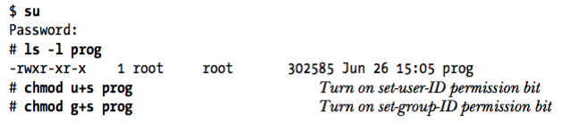

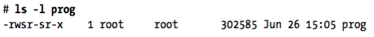

___
## set-user(group)-ID Program

* When a set-UID program is run, kernel sets the effective user ID of the process to be the same as the UID of the executable file
  * Commonly used set-UID programs on Linux
  * passwd
  * mount & umount
  * su
* set-GID program
* wall : writes a message to all terminals owned by the tty group

___

## set-user(group)-ID Program

```bash
user1@4a834953099d:/proc$ passwd
Changing password for user1.
Current password: 
```

In another terminal:
```bash
user1@4a834953099d:/proc$ ps auf

user1      657  0.0  0.1   4004  3292 pts/0    S    21:57   0:00  \_ bash
root       679  0.0  0.1   4460  2648 pts/0    S+   22:04   0:00      \_ passwd
```
```bash
user1@4a834953099d:/proc/679$ vi status
	*
	*
Uid:    1000    0       0       0
	*
```
___

## saved set-user(group)-ID

* copied from the effective UID (GID)
* Example: A process with following UID
```
real=1000  effective=1000  saved=1000
```
executes a set-UID program owned by root 
(UID 0), after execution, UID will be
```
real=1000  effective=0         saved=0
```
* Having a saved user id allows you to drop your privileges (by switching the effective uid to the real one) and then regain them (by switching the effective uid to the saved one) only when needed

___

## file-system user (group) ID

* On Linux, file-system UID (GID), rather than effective UID (GID), is used to determine permissions when performing file-system operations such as
  * opening files
  * changing file ownership
  * modifying file permissions
* The effective IDs are still used for the other purposes described earlier
___

## /proc File System

* In older UNIX implementation, it was not easy to answer the questions like
  * How many processes are running on the system and who owns them?
  * What files does a process have open?
  * What files are currently locked, and which processes hold the locks?
  * What sockets are being used on the system?
* Privileged programs were provided the information from the data structures in kernel memory requiring specialized knowledge of the kernel data structure

___

## /proc File System

* Many modern UNIX implementation provided a /proc virtual file system
  * Files and subdirectories DO NOT reside on a disk
* The kernel creates them “on the fly” as processes access them
* A process can conveniently read kernel information and change it using normal file I/O system calls

___

## Obtaining Information about a Process: /proc/PID
```bash
$ cat /proc/1/status
```

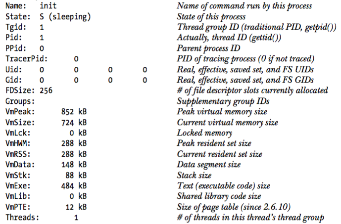
___

## Obtaining Information about a Process: /proc/PID

```bash
$ cat /proc/1/status
```

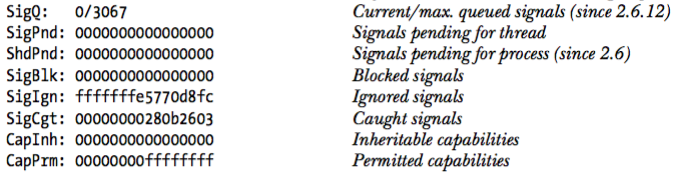

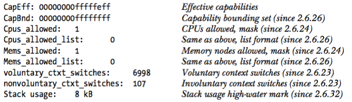


___

## Obtaining Information about a Process: /proc/PID

Selected files in each /proc/PID directory

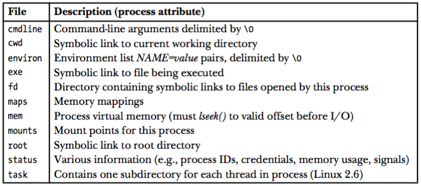

___

## /proc/PID/fd

* contains one symbolic link for each file descriptor that the process has open
* symbolic link to the standard output of process 1968
```bash
/proc/1968/fd/1
```
* As a convenience, any process can access its own /proc/PID directory using the /proc/self

___

## /proc/PID/task

* Linux added a task subdirectory
* For each thread in this process, the kernel provides a subdirectory named /proc/PID/task/TID
  * TID is the thread ID of the thread
  * exactly same as /proc/PID

___

## System Information under /proc

* provides access to system-wide information

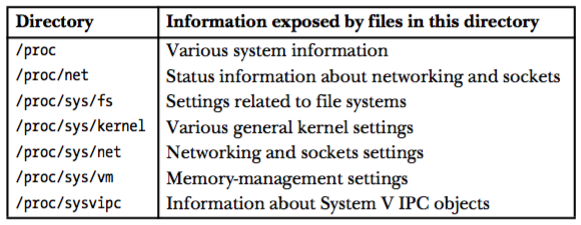


___

## Accessing /proc Files

* by shell script
```bash
$ cat /proc/sys/kernel/pid_max
99999
```
* by file I/O system calls
  * Some /proc files are read-only
  * Some /proc files can be read only by the file owner or by a privileged process
  * Most files under /proc (other than /proc/PID) are owned by root

___

## /proc

Selected files and 
subdirectories
under /proc

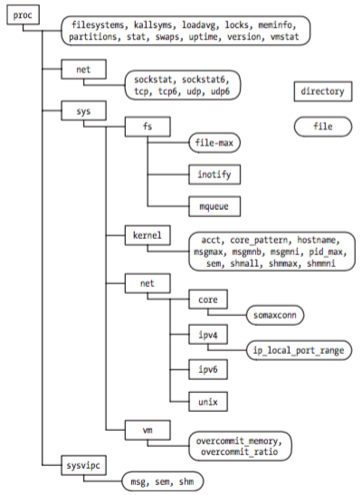

___

## Accessing files in /proc/PID

* /proc/PID directories are volatile
  * exists when a process (with corresponding PID) is created
  * disappears when that process terminates

___

## pid_max.c

reads and displays contents of  /proc/sys/kernel/pid_max

```c
#include <stdio.h>
#include <stdlib.h>
#include <fcntl.h>
#include <string.h>
#include <unistd.h>

#define MAX_LINE 100

int main(int argc, char *argv[])
{
    int fd;
    char line[MAX_LINE];
    ssize_t n;

    fd = open("/proc/sys/kernel/pid_max", (argc > 1) ? O_RDWR : O_RDONLY);
    if (fd == -1) {
        perror("open");
        exit(EXIT_FAILURE);
    }

    n = read(fd, line, MAX_LINE);
    if (n == -1) {
        perror("read");
        exit(EXIT_FAILURE);
    }

    if (argc > 1)
        printf("Old value: ");
    printf("%.*s", (int) n, line);

    if (argc > 1) {
        if (lseek(fd, 0, SEEK_SET) == -1) {
            perror("lseek");
            exit(EXIT_FAILURE);
        }

        if (write(fd, argv[1], strlen(argv[1])) != strlen(argv[1])) {
            fprintf(stderr, "write() failed\n");
            exit(EXIT_FAILURE);
        }

        system("echo /proc/sys/kernel/pid_max now contains "
               "`cat /proc/sys/kernel/pid_max`");
    }

    exit(EXIT_SUCCESS);
}
```

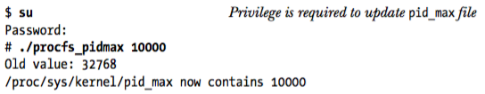

___

## System Identification: uname()

```c
#include <sys/utsname.h>

int uname(struct utsname *utsbuf);
					returns 0 on success, or -1 on error
```

* **uname()** system call returns a range of identifying information about the host system
* utsbuf is a pointer to a utsname structure

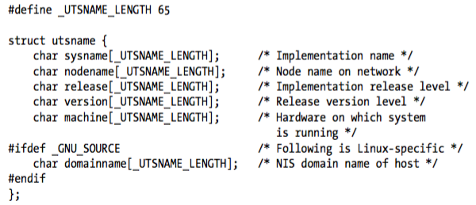

___

## System Identification: uname()
```c
/* t_uname.c

   Demonstrate the use of the uname() system call, which returns various
   identifying information about the system.
*/
#ifdef __linux__
#define _GNU_SOURCE
#endif
#include <stdio.h>
#include <stdlib.h>
#include <sys/utsname.h>

int
main(int argc, char *argv[])
{
    struct utsname uts;

    if (uname(&uts) == -1) {
        perror("uname");
        exit(EXIT_FAILURE);
    }

    printf("Node name:   %s\n", uts.nodename);
    printf("System name: %s\n", uts.sysname);
    printf("Release:     %s\n", uts.release);
    printf("Version:     %s\n", uts.version);
    printf("Machine:     %s\n", uts.machine);
#ifdef _GNU_SOURCE
    printf("Domain name: %s\n", uts.domainname);
#endif
    exit(EXIT_SUCCESS);
}
```

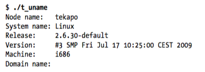

___
